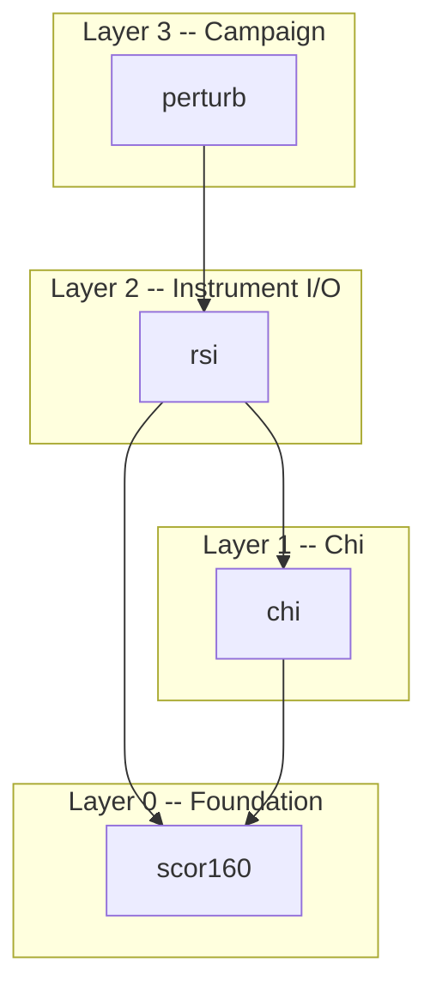
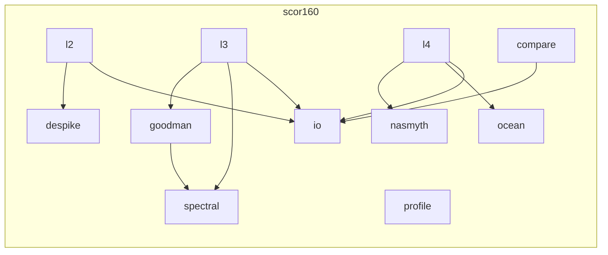
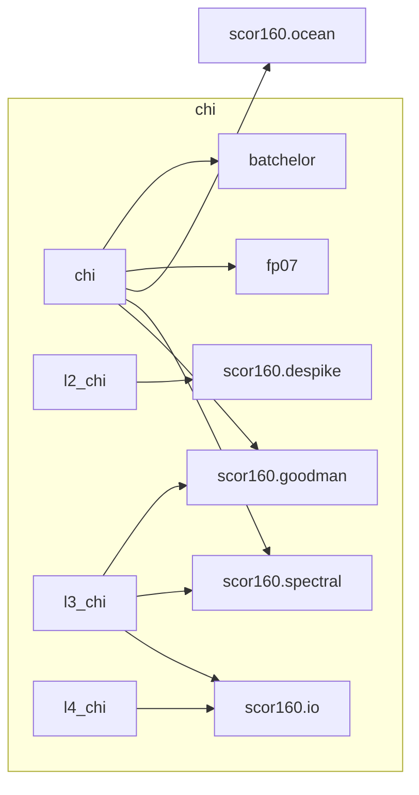
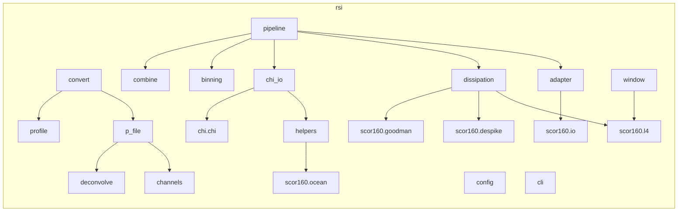
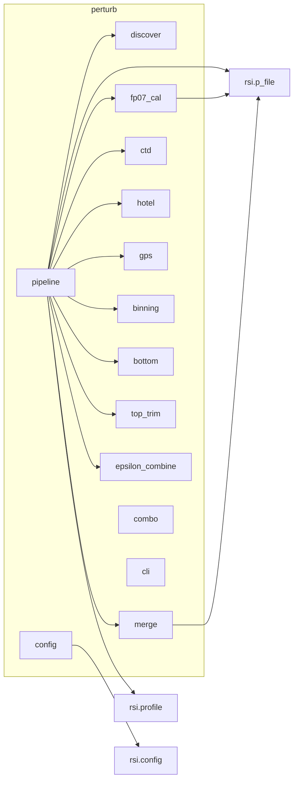

# Software Architecture

One top-level package (`odas_tpw`) with four subpackages in a
layered dependency hierarchy.  Each layer can only import from layers below it.

```
odas_tpw.perturb     Campaign pipeline (VMP data -> science-ready NetCDF)
    |
odas_tpw.rsi         Rockland .P file I/O, NetCDF conversion, profiles
    |
odas_tpw.chi         Thermal variance dissipation (chi) from FP07 thermistors
    |
odas_tpw.scor160     SCOR-160 / ATOMIX spectral processing + shared physics
```

---

## Package dependency diagram



---

## Package contents

### scor160 -- Foundation (Layer 0)

Base-level processing library.  No dependencies on other in-repo
packages.  Contains the ATOMIX benchmark pipeline **and** the shared
physics / signal-processing modules used by all higher layers.

| Module | Role |
|--------|------|
| `ocean.py` | Seawater properties: `visc35`, `visc(T,S,P)`, `density`, `buoyancy_freq` (TEOS-10 via gsw) |
| `nasmyth.py` | Nasmyth universal shear spectrum (Lueck improved fit) |
| `spectral.py` | Cross-spectral density estimation (Welch method, cosine window) |
| `goodman.py` | Goodman coherent noise removal using accelerometer cross-spectra |
| `despike.py` | Iterative spike removal for shear probe signals |
| `profile.py` | Profile detection: `get_profiles()`, `smooth_fall_rate()` |
| `io.py` | ATOMIX-format NetCDF I/O and data classes (`L1Data` ... `L4Data`) |
| `l2.py` | L1->L2: section selection, despiking, HP filtering |
| `l3.py` | L2->L3: wavenumber spectra (Welch + Goodman) |
| `l4.py` | L3->L4: epsilon estimation (variance + ISR methods), `_estimate_epsilon()` |
| `compare.py` | Benchmark comparison utilities and report formatting |
| `cli.py` | `scor160-tpw` CLI entry point |

**External dependencies:** numpy, scipy, gsw, netCDF4



---

### chi -- Thermal Dissipation (Layer 1)

Chi (thermal variance dissipation rate) calculation.  Depends on
`scor160` for ocean properties, spectral processing, Goodman
cleaning, despiking, and data classes.

| Module | Role |
|--------|------|
| `chi.py` | Chi estimation, Methods 1 and 2, QC metrics |
| `batchelor.py` | Batchelor and Kraichnan temperature gradient spectra |
| `fp07.py` | FP07 thermistor transfer function and electronics noise model |
| `l2_chi.py` | `process_l2_chi()` -- temperature cleaning (despike, HP filter) |
| `l3_chi.py` | `process_l3_chi()` -- temperature gradient spectra (Welch + Goodman) |
| `l4_chi.py` | `process_l4_chi_epsilon()`, `process_l4_chi_fit()` -- chi from epsilon or iterative fit |

**Imports from scor160:** `ocean`, `spectral`, `goodman`, `despike`, `io`



---

### rsi -- Instrument I/O (Layer 2)

Reads Rockland Scientific `.P` binary files, converts to NetCDF,
extracts profiles, and runs the full epsilon/chi pipeline.
Depends on `scor160` for spectral processing and ocean physics,
and on `chi` for thermal dissipation.

| Module | Role |
|--------|------|
| `p_file.py` | `PFile` class: reads `.P` binary, parses headers, demultiplexes, converts to physical units |
| `channels.py` | Raw counts -> physical units conversion functions |
| `deconvolve.py` | Sensor deconvolution filters |
| `convert.py` | `p_to_L1()` / `p_to_netcdf()`, `convert_all()` -- NetCDF output |
| `profile.py` | Profile detection (re-exports from scor160) and per-profile NetCDF extraction |
| `helpers.py` | `load_channels()`, `prepare_profiles()` -- bridge PFile/NetCDF to spectral processing |
| `dissipation.py` | `get_diss()`, `compute_diss_file()` -- core epsilon calculation |
| `chi_io.py` | `get_chi()`, `compute_chi_file()` -- load instrument data and call chi computation |
| `adapter.py` | `pfile_to_l1data()` -- bridge PFile to scor160 L1Data |
| `pipeline.py` | `run_pipeline()` -- full L0->L6 processing pipeline |
| `binning.py` | `bin_by_depth()` -- depth-bin averaging |
| `combine.py` | `combine_profiles()` -- merge profiles across deployments |
| `window.py` | Per-window epsilon and chi computation (shared by pipeline and viewers) |
| `config.py` | YAML configuration loading, merging, template generation |
| `cli.py` | `rsi-tpw` CLI entry point |
| `quick_look.py` | Interactive quick-look viewer |
| `diss_look.py` | Interactive dissipation quality viewer |
| `viewer_base.py` | Shared viewer base class |
| `shear_noise.py` | Shear probe electronics noise model |

**Imports from scor160:** `ocean`, `spectral`, `goodman`, `despike`, `l4`, `profile`
**Imports from chi:** `chi`, `l2_chi`, `l3_chi`, `l4_chi`, `fp07`



---

### perturb -- Campaign Pipeline (Layer 3)

End-to-end processing pipeline for VMP deployment campaigns.  Discovers
`.P` files, merges split recordings, runs epsilon and chi, bins results,
and combines across profiles and casts.

| Module | Role |
|--------|------|
| `pipeline.py` | Orchestrates the full L0->L6 pipeline |
| `discover.py` | Finds and orders `.P` files from a directory tree |
| `merge.py` | Merges split `.P` files into contiguous records |
| `trim.py` | Trims `.P` file headers/records |
| `top_trim.py` | Top-of-profile trimming logic |
| `bottom.py` | Bottom crash detection via accelerometers |
| `fp07_cal.py` | FP07 thermistor calibration |
| `ctd.py` | CTD processing (salinity, density) |
| `ct_align.py` | Conductivity-temperature alignment |
| `seawater.py` | Seawater properties (TEOS-10 via gsw) |
| `hotel.py` | Ship hotel data ingestion |
| `gps.py` | GPS position processing |
| `binning.py` | Depth-bin averaging |
| `combo.py` | Cross-profile combination |
| `epsilon_combine.py` | Per-probe epsilon combination logic |
| `netcdf_schema.py` | NetCDF output schema definitions |
| `config.py` | Campaign-level configuration |
| `cli.py` | `perturb` CLI entry point |

**Imports from rsi:** `PFile`, `extract_profiles`, `get_profiles`



---

## Full dependency graph

```mermaid
graph TB
    subgraph "Layer 3: perturb"
        P_pipe[pipeline]
        P_disc[discover]
        P_merge[merge]
        P_trim[trim]
        P_top[top_trim]
        P_bot[bottom]
        P_fp07[fp07_cal]
        P_ctd[ctd]
        P_hotel[hotel]
        P_gps[gps]
        P_bin[binning]
        P_combo[combo]
        P_eps[epsilon_combine]
        P_nc[netcdf_schema]
        P_conf[config]
    end

    subgraph "Layer 2: rsi"
        R_pfile[p_file]
        R_chan[channels]
        R_deconv[deconvolve]
        R_diss[dissipation]
        R_chi_io[chi_io]
        R_conv[convert]
        R_prof[profile]
        R_help[helpers]
        R_adapt[adapter]
        R_pipe[pipeline]
        R_bin[binning]
        R_comb[combine]
        R_win[window]
        R_conf[config]
    end

    subgraph "Layer 1: chi"
        C_chi[chi]
        C_bat[batchelor]
        C_fp07[fp07]
        C_l2[l2_chi]
        C_l3[l3_chi]
        C_l4[l4_chi]
    end

    subgraph "Layer 0: scor160"
        S_ocean[ocean]
        S_nas[nasmyth]
        S_spec[spectral]
        S_good[goodman]
        S_desp[despike]
        S_prof[profile]
        S_io[io]
        S_l2[l2]
        S_l3[l3]
        S_l4[l4]
        S_comp[compare]
    end

    %% Layer 0 internal
    S_good --> S_spec
    S_l2 --> S_desp
    S_l2 --> S_io
    S_l3 --> S_good
    S_l3 --> S_spec
    S_l3 --> S_io
    S_l4 --> S_nas
    S_l4 --> S_ocean
    S_l4 --> S_io
    S_comp --> S_io

    %% Layer 1 -> Layer 0
    C_chi --> C_bat
    C_chi --> C_fp07
    C_chi --> S_ocean
    C_chi --> S_spec
    C_chi --> S_good
    C_l2 --> S_desp
    C_l3 --> S_good
    C_l3 --> S_spec
    C_l3 --> S_io
    C_l4 --> S_io

    %% Layer 2 internal
    R_pfile --> R_chan
    R_pfile --> R_deconv
    R_conv --> R_pfile
    R_conv --> R_prof

    %% Layer 2 -> Layer 1
    R_chi_io --> C_chi
    R_chi_io --> R_help

    %% Layer 2 -> Layer 0
    R_help --> S_ocean
    R_diss --> S_l4
    R_diss --> S_desp
    R_diss --> S_good
    R_win --> S_l4
    R_adapt --> S_io

    %% Layer 3 -> Layer 2
    P_pipe --> R_pfile
    P_pipe --> R_prof
    P_fp07 --> R_pfile
    P_merge --> R_pfile
    P_trim --> R_pfile
    P_conf --> R_conf
```



---

## CLI entry points

| Command | Package | Description |
|---------|---------|-------------|
| `scor160-tpw` | scor160 | ATOMIX benchmark processing (L1-L4) |
| `rsi-tpw` | rsi | .P file I/O, epsilon, chi, full pipeline, viewers |
| `perturb` | perturb | Full campaign pipeline |
