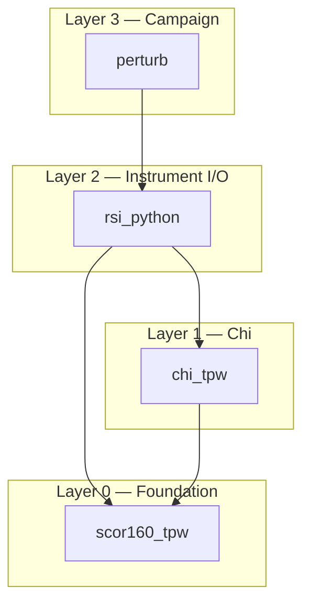
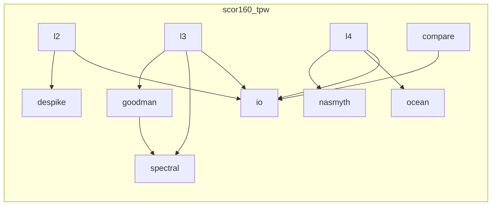
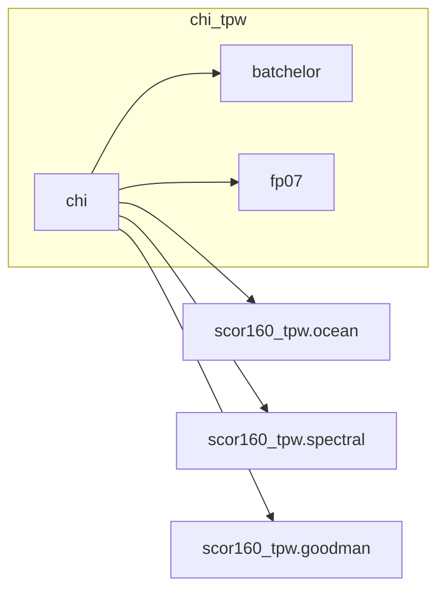
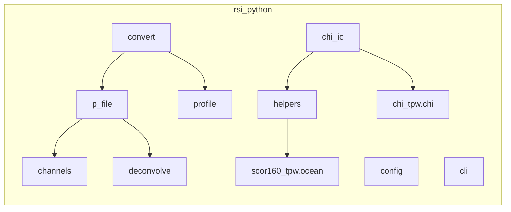
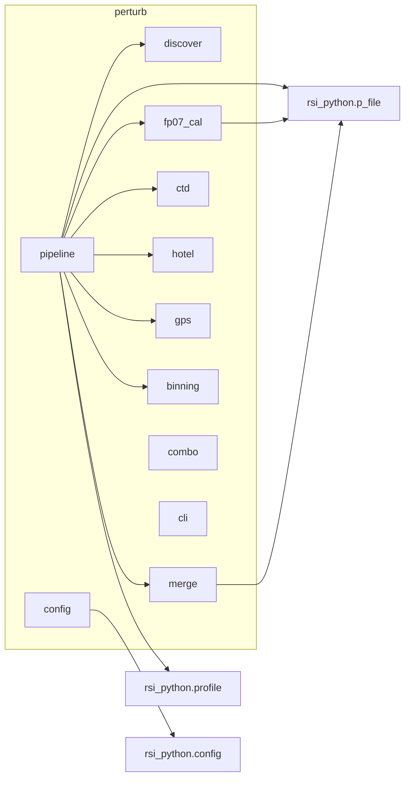

# Software Architecture

Four Python packages with a layered dependency hierarchy.  Each layer
can only import from layers below it.

```
perturb            Campaign pipeline (VMP data → science-ready NetCDF)
    ↓
rsi_python         Rockland .P file I/O, NetCDF conversion, profiles
    ↓
chi_tpw            Thermal variance dissipation (χ) from FP07 thermistors
    ↓
scor160_tpw        SCOR-160 / ATOMIX spectral processing + shared physics
```

---

## Package dependency diagram



---

## Package contents

### scor160_tpw — Foundation (Layer 0)

Base-level processing library.  No dependencies on other in-repo
packages.  Contains the ATOMIX benchmark pipeline **and** the shared
physics / signal-processing modules used by all higher layers.

| Module | Role |
|--------|------|
| `ocean.py` | Seawater properties: `visc35`, `visc(T,S,P)`, `density`, `buoyancy_freq` (TEOS-10 via gsw) |
| `nasmyth.py` | Nasmyth universal shear spectrum (Lueck improved fit) |
| `spectral.py` | Cross-spectral density estimation (Welch method, cosine window) |
| `goodman.py` | Goodman coherent noise removal using accelerometer cross-spectra |
| `despike.py` | Iterative spike removal for shear probe signals |
| `io.py` | ATOMIX-format NetCDF I/O and data classes (`L1Data` … `L4Data`) |
| `l2.py` | L1→L2: section selection, despiking, HP filtering |
| `l3.py` | L2→L3: wavenumber spectra (Welch + Goodman) |
| `l4.py` | L3→L4: epsilon estimation (variance + ISR methods) |
| `compare.py` | Benchmark comparison utilities and report formatting |
| `cli.py` | `scor160-tpw` CLI entry point |

**External dependencies:** numpy, scipy, gsw, netCDF4



---

### chi_tpw — Thermal Dissipation (Layer 1)

Chi (thermal variance dissipation rate) calculation.  Depends on
`scor160_tpw` for ocean properties, spectral processing, and Goodman
cleaning.

| Module | Role |
|--------|------|
| `chi.py` | `get_chi()` — chi estimation, Methods 1 and 2, QC metrics |
| `batchelor.py` | Batchelor and Kraichnan temperature gradient spectra |
| `fp07.py` | FP07 thermistor transfer function and electronics noise model |

**Imports from scor160_tpw:** `ocean`, `spectral`, `goodman`



---

### rsi_python — Instrument I/O (Layer 2)

Reads Rockland Scientific `.P` binary files, converts to NetCDF, and
extracts profiles.  Depends on `scor160_tpw` for ocean physics and on
`chi_tpw` for thermal dissipation.

| Module | Role |
|--------|------|
| `p_file.py` | `PFile` class: reads `.P` binary, parses headers, demultiplexes, converts to physical units |
| `channels.py` | Raw counts → physical units conversion functions |
| `deconvolve.py` | Sensor deconvolution filters |
| `convert.py` | `p_to_netcdf()`, `p_to_L1()`, `convert_all()` — NetCDF output |
| `profile.py` | Profile detection and per-profile NetCDF extraction |
| `helpers.py` | `load_channels()`, `prepare_profiles()`, `compute_nu()` — bridge PFile/NetCDF to spectral processing |
| `chi_io.py` | `get_chi()`, `compute_chi_file()` — load instrument data and call chi_tpw computation |
| `config.py` | YAML configuration loading, merging, template generation |
| `cli.py` | `rsi-tpw` CLI entry point |

**Imports from scor160_tpw:** `ocean` (via helpers.py)
**Imports from chi_tpw:** `_compute_profile_chi` (via chi_io.py)



---

### perturb — Campaign Pipeline (Layer 3)

End-to-end processing pipeline for VMP deployment campaigns.  Discovers
`.P` files, merges split recordings, runs epsilon and chi, bins results,
and combines across profiles and casts.

| Module | Role |
|--------|------|
| `pipeline.py` | Orchestrates the full L0→L6 pipeline |
| `discover.py` | Finds and orders `.P` files from a directory tree |
| `merge.py` | Merges split `.P` files into contiguous records |
| `trim.py` | Trims `.P` file headers/records |
| `fp07_cal.py` | FP07 thermistor calibration |
| `ctd.py` | CTD processing (salinity, density) |
| `ct_align.py` | Conductivity–temperature alignment |
| `hotel.py` | Ship hotel data ingestion |
| `gps.py` | GPS position processing |
| `binning.py` | Depth-bin averaging |
| `combo.py` | Cross-profile combination |
| `config.py` | Campaign-level configuration |
| `cli.py` | `perturb` CLI entry point |

**Imports from rsi_python:** `PFile`, `extract_profiles`, `get_profiles`



---

## Full dependency graph

```mermaid
graph TB
    subgraph "Layer 3: perturb"
        P_pipe[pipeline]
        P_disc[discover]
        P_merge[merge]
        P_trim[trim]
        P_fp07[fp07_cal]
        P_ctd[ctd]
        P_hotel[hotel]
        P_gps[gps]
        P_bin[binning]
        P_combo[combo]
        P_conf[config]
    end

    subgraph "Layer 2: rsi_python"
        R_pfile[p_file]
        R_chan[channels]
        R_deconv[deconvolve]
        R_chi_io[chi_io]
        R_conv[convert]
        R_prof[profile]
        R_help[helpers]
        R_conf[config]
    end

    subgraph "Layer 1: chi_tpw"
        C_chi[chi]
        C_bat[batchelor]
        C_fp07[fp07]
    end

    subgraph "Layer 0: scor160_tpw"
        S_ocean[ocean]
        S_nas[nasmyth]
        S_spec[spectral]
        S_good[goodman]
        S_desp[despike]
        S_io[io]
        S_l2[l2]
        S_l3[l3]
        S_l4[l4]
        S_comp[compare]
    end

    %% Layer 0 internal
    S_good --> S_spec
    S_l2 --> S_desp
    S_l2 --> S_io
    S_l3 --> S_good
    S_l3 --> S_spec
    S_l3 --> S_io
    S_l4 --> S_nas
    S_l4 --> S_ocean
    S_l4 --> S_io
    S_comp --> S_io

    %% Layer 1 → Layer 0
    C_chi --> C_bat
    C_chi --> C_fp07
    C_chi --> S_ocean
    C_chi --> S_spec
    C_chi --> S_good

    %% Layer 2 internal
    R_pfile --> R_chan
    R_pfile --> R_deconv
    R_conv --> R_pfile
    R_conv --> R_prof

    %% Layer 2 → Layer 1
    R_chi_io --> C_chi
    R_chi_io --> R_help

    %% Layer 2 → Layer 0
    R_help --> S_ocean

    %% Layer 3 → Layer 2
    P_pipe --> R_pfile
    P_pipe --> R_prof
    P_fp07 --> R_pfile
    P_merge --> R_pfile
    P_trim --> R_pfile
    P_conf --> R_conf
```



---

## CLI entry points

| Command | Package | Description |
|---------|---------|-------------|
| `scor160-tpw` | scor160_tpw | ATOMIX benchmark processing (L1–L4) |
| `rsi-tpw` | rsi_python | .P file info, NetCDF conversion, profile extraction |
| `perturb` | perturb | Full campaign pipeline |

