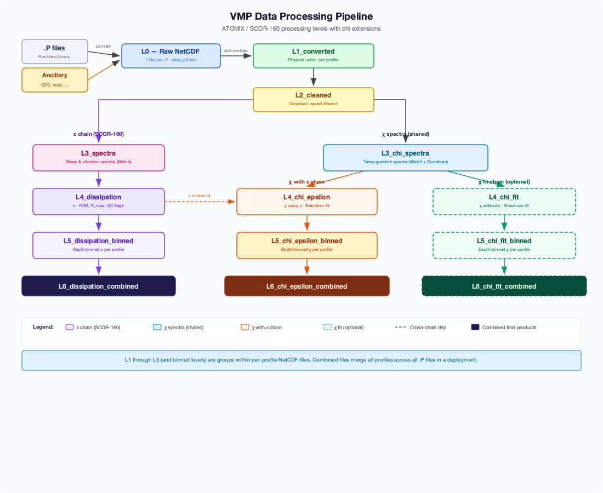

# VMP Data Processing Pipeline

Processing levels for turbulent kinetic energy (TKE) dissipation and thermal
variance dissipation (chi) from Rockland Scientific vertical microprofilers.
Levels L1 through L4_dissipation follow the ATOMIX / SCOR-160 shear-probe
benchmark (Lueck et al., 2024, doi:10.3389/fmars.2024.1334327).
Chi levels and binning are extensions to the SCOR-160 framework.



---

## File organisation

| Stage | Files | Scope |
|-------|-------|-------|
| .P files | `VMP/*.p` | Raw Rockland binary, one per deployment cast |
| Ancillary | various | GPS, hotel, and other auxiliary data |
| L0 | `nc/<name>.nc` | One NetCDF per .P file, all records |
| Per-profile | `profiles/<name>_NNN.nc` | One NetCDF per detected profile |
| Combined | `results/<name>_combined.nc` | One per chain per deployment, merging all profiles across all .P files |

---

## Processing overview

From L2_cleaned, the pipeline splits into two branches:

1. **Epsilon chain (SCOR-160):** L3_spectra → L4_dissipation → L5_dissipation_binned → L6_dissipation_combined
2. **Chi spectra (shared):** L3_chi_spectra (temperature gradient spectra, common to both chi methods)

From L3_chi_spectra, the chi pipeline splits into two parallel chains:

1. **Chi with epsilon chain:** L3_chi_spectra + L4_dissipation → L4_chi_epsilon → L5_chi_epsilon_binned → L6_chi_epsilon_combined
2. **Chi fit chain (optional):** L3_chi_spectra → L4_chi_fit → L5_chi_fit_binned → L6_chi_fit_combined

---

## Common levels

### L0 — Raw NetCDF

**Source:** .P binary files + ancillary data (GPS, hotel, etc.)
**Output:** One NetCDF file per .P file
**NetCDF group:** root (no group)

Equivalent to the ODAS `odas_p2mat` output.  Reads the .P binary, parses
the header and configuration string, demultiplexes the address matrix, and
converts all channels to physical units.  Ancillary data (GPS positions,
hotel/ship systems, etc.) are also ingested at this stage and merged into
the NetCDF output.  No profile splitting, no filtering.

**Contents:**
- Fast-rate channels at native sampling (≈512 Hz): shear probes, fast
  thermistors (FP07), piezo accelerometers, chlorophyll, turbidity
- Slow-rate channels (≈64 Hz): pressure, JAC CT temperature and
  conductivity, inclinometer, dissolved oxygen, battery voltage
- Time vectors (`t_fast`, `t_slow`) in seconds since start
- Profiling speed derived from pressure
- Global attributes: `fs_fast`, `fs_slow`, instrument metadata,
  configuration string

---

### L1_converted

**Source:** L0, split into individual profiles
**NetCDF group:** `L1_converted`
**Scope:** per profile

The SCOR-160 starting point for each profile.  Contains time series in
physical units following the ATOMIX variable naming convention.  Speed
normalisation is applied to shear (du/dz) and temperature gradient (dT/dz)
as required by the benchmark specification.

**Variables:**

| Variable | Dimensions | Units | Description |
|----------|-----------|-------|-------------|
| TIME | (TIME,) | days since YYYY-01-01 | Fast-rate decimal day |
| TIME_SLOW | (TIME_SLOW,) | days since YYYY-01-01 | Slow-rate decimal day |
| PRES | (TIME,) | decibar | Pressure interpolated to fast rate |
| PRES_SLOW | (TIME_SLOW,) | decibar | Pressure at native slow rate |
| SHEAR | (N_SHEAR_SENSORS, TIME) | s-1 | Velocity shear du/dz |
| VIB | (N_VIB_SENSORS, TIME) | 1 | Piezo accelerometer vibration |
| ACC | (N_ACC_SENSORS, TIME) | m s-2 | Linear accelerometer (if present) |
| GRADT | (N_GRADT_SENSORS, TIME) | degrees_Celsius m-1 | Temperature gradient dT/dz |
| TEMP | (N_TEMP_SENSORS, TIME) | degree_Celsius | Fast FP07 thermistor temperature |
| TEMP_CTD | (TIME_SLOW,) | degree_Celsius | Slow CTD temperature (JAC_T) |
| COND_CTD | (TIME_SLOW,) | mS cm-1 | Slow CTD conductivity (JAC_C) |
| PITCH | (TIME_SLOW,) | degrees | Platform pitch angle |
| ROLL | (TIME_SLOW,) | degrees | Platform roll angle |
| MAG | (N_MAG_SENSORS, TIME_SLOW) | micro_Tesla | Magnetometer (if present) |
| CHLA | (TIME,) | ug L-1 | Chlorophyll-a fluorescence |
| TURB | (TIME,) | FTU | Turbidity |
| DOXY | (TIME_SLOW,) | umol L-1 | Dissolved oxygen |
| DOXY_TEMP | (TIME_SLOW,) | degree_Celsius | Oxygen optode temperature |

**Group attributes:** `fs_fast`, `fs_slow`, `f_AA`, `vehicle`,
`time_reference_year`

---

### L2_cleaned

**Source:** L1_converted
**NetCDF group:** `L2_cleaned`
**Scope:** per profile

Cleaned time series ready for spectral analysis.

**Processing:**
- Despike shear and accelerometer channels (iterative median filter)
- Apply speed filter (discard segments below minimum profiling speed)
- Segment into dissipation-length windows with overlap

**Variables:**

| Variable | Dimensions | Description |
|----------|-----------|-------------|
| TIME | (TIME,) | Time coordinate |
| SHEAR | (N_SHEAR_SENSORS, TIME) | Despiked shear |
| VIB or ACC | (N_VIB_SENSORS, TIME) | Despiked vibration/acceleration |
| PSPD_REL | (TIME,) or (TIME_SLOW,) | Profiling speed |
| SECTION_NUMBER | (TIME,) | Dissipation window index |

---

## Epsilon chain (SCOR-160)

`L2_cleaned → L3_spectra → L4_dissipation → L5_dissipation_binned → L6_dissipation_combined`

### L3_spectra

**Source:** L2_cleaned
**NetCDF group:** `L3_spectra`
**Scope:** per profile

Power spectral densities computed via Welch's method with a cosine
(half-overlapped) window for each dissipation window.

**Processing:**
- Compute shear spectra and vibration/accelerometer spectra per segment
- Apply Goodman coherent noise removal → clean shear spectra
- Compute temperature gradient spectra

**Variables:**

| Variable | Dimensions | Description |
|----------|-----------|-------------|
| TIME | (N_SEGMENT,) | Mid-segment time |
| PRES | (N_SEGMENT,) | Mid-segment pressure |
| TEMP | (N_SEGMENT,) | Mid-segment temperature |
| PSPD_REL | (N_SEGMENT,) | Segment-mean profiling speed |
| KCYC | (N_KCYC,) | Wavenumber vector (cpm) |
| SH_SPEC | (N_SHEAR_SENSORS, N_SEGMENT, N_KCYC) | Raw shear spectra |
| SH_SPEC_CLEAN | (N_SHEAR_SENSORS, N_SEGMENT, N_KCYC) | Cleaned shear spectra |
| VIB_SPEC or ACC_SPEC | (..., N_SEGMENT, N_KCYC) | Vibration/accelerometer spectra |
| DOF | scalar or (N_SEGMENT,) | Degrees of freedom |
| N_FFT_SEGMENTS | scalar | FFT sub-segments per window |
| SECTION_NUMBER | (N_SEGMENT,) | Window index |

---

### L4_dissipation

**Source:** L3_spectra
**NetCDF group:** `L4_dissipation`
**Scope:** per profile

TKE dissipation rate ε estimated by fitting the Nasmyth spectrum to the
observed shear spectra.

**Processing:**
- Iterative Nasmyth spectral fit over the integration wavenumber range
- Compute figure of merit (FOM), K_max ratio, and other QC metrics
- Select final ε from best-quality shear probe

**Variables:**

| Variable | Dimensions | Description |
|----------|-----------|-------------|
| TIME | (N_SEGMENT,) | Mid-segment time |
| PRES | (N_SEGMENT,) | Mid-segment pressure |
| TEMP | (N_SEGMENT,) | Mid-segment temperature |
| EPSI | (N_SHEAR_SENSORS, N_SEGMENT) | ε per shear probe |
| EPSI_FINAL | (N_SEGMENT,) | Selected best ε |
| FOM | (N_SHEAR_SENSORS, N_SEGMENT) | Figure of merit |
| MAD | (N_SHEAR_SENSORS, N_SEGMENT) | Mean absolute deviation |
| KMAX | (N_SHEAR_SENSORS, N_SEGMENT) | Upper integration wavenumber |
| N_S | (N_SHEAR_SENSORS, N_SEGMENT) | Nasmyth fit iteration count |
| KVISC | (N_SEGMENT,) | Kinematic viscosity |
| PSPD_REL | (N_SEGMENT,) | Profiling speed |
| METHOD | scalar | Integration method identifier |
| EPSI_FLAGS | (N_SHEAR_SENSORS, N_SEGMENT) | Bitwise QC flags |
| VAR_RESOLVED | (N_SHEAR_SENSORS, N_SEGMENT) | Fraction of variance resolved |

---

### L5_dissipation_binned

**Source:** L4_dissipation
**NetCDF group:** `L5_dissipation_binned`
**Scope:** per profile

Depth-binned averages of ε within each profile.

**Processing:**
- Bin L4_dissipation results by pressure
- Compute bin-averaged ε (geometric mean) and aggregated QC metrics

---

### L6_dissipation_combined

**Source:** L5_dissipation_binned from all profiles across all .P files
**Output:** Single NetCDF file per deployment
**Scope:** entire deployment

Final epsilon data product.  Merges L5_dissipation_binned across all
profiles from all .P files in a deployment.

**Dimensions:** `(N_PROFILE, N_DEPTH_BIN)`

---

## Chi spectra (shared)

`L2_cleaned → L3_chi_spectra`

Temperature gradient spectra shared by both chi methods.  The spectral
computation is identical whether or not epsilon is available — only the
downstream fitting step differs.

### L3_chi_spectra

**Source:** L2_cleaned
**NetCDF group:** `L3_chi_spectra`
**Scope:** per profile

Temperature gradient power spectral densities computed via Welch's method
with optional Goodman coherent noise removal using accelerometers.

**Processing:**
- Convert fast thermistor temperature to spatial gradient dT/dz (first-difference, speed-normalised)
- Compute temperature gradient spectra per dissipation window (Welch method)
- Apply Goodman coherent noise removal (if accelerometers present)
- Apply first-difference and bilinear corrections

**Variables:**

| Variable | Dimensions | Description |
|----------|-----------|-------------|
| TIME | (N_SEGMENT,) | Mid-segment time |
| PRES | (N_SEGMENT,) | Mid-segment pressure |
| TEMP | (N_SEGMENT,) | Mid-segment temperature |
| PSPD_REL | (N_SEGMENT,) | Segment-mean profiling speed |
| KCYC | (N_KCYC,) | Wavenumber vector (cpm) |
| GRADT_SPEC | (N_GRADT_SENSORS, N_SEGMENT, N_KCYC) | Temperature gradient spectra |
| NOISE_SPEC | (N_GRADT_SENSORS, N_SEGMENT, N_KCYC) | Electronics noise floor |
| DOF | scalar or (N_SEGMENT,) | Degrees of freedom |
| SECTION_NUMBER | (N_SEGMENT,) | Window index |

---

## Chi fit chain (optional)

`L3_chi_spectra → L4_chi_fit → L5_chi_fit_binned → L6_chi_fit_combined`

Independent of the epsilon chain.  Computes χ without requiring ε.

### L4_chi_fit

**Source:** L3_chi_spectra
**NetCDF group:** `L4_chi_fit`
**Scope:** per profile
**Status:** optional

Thermal variance dissipation rate χ computed without ε (Method 2).
A Kraichnan model is fit directly to the temperature gradient spectrum
by jointly estimating χ and the Batchelor wavenumber.

This method is independent of the shear-probe ε estimate but may be less
constrained at high wavenumbers where the FP07 transfer function
correction is large.

---

### L5_chi_fit_binned

**Source:** L4_chi_fit
**NetCDF group:** `L5_chi_fit_binned`
**Scope:** per profile

Depth-binned averages of χ (Method 2) within each profile.

---

### L6_chi_fit_combined

**Source:** L5_chi_fit_binned from all profiles across all .P files
**Output:** Single NetCDF file per deployment
**Scope:** entire deployment

Final chi-fit data product.  Merges L5_chi_fit_binned across all profiles
from all .P files in a deployment.

**Dimensions:** `(N_PROFILE, N_DEPTH_BIN)`

---

## Chi with epsilon chain

`L3_chi_spectra + L4_dissipation → L4_chi_epsilon → L5_chi_epsilon_binned → L6_chi_epsilon_combined`

Requires ε from the epsilon chain (cross-chain dependency).

### L4_chi_epsilon

**Source:** L3_chi_spectra + L4_dissipation
**NetCDF group:** `L4_chi_epsilon`
**Scope:** per profile

Thermal variance dissipation rate χ computed using ε from L4_dissipation
(Method 1).  The Batchelor spectrum, parameterised by ε, is fit to the
observed temperature gradient spectrum.

**Processing:**
- Use ε and kinematic viscosity to compute the Batchelor wavenumber
- Fit the Batchelor/Kraichnan temperature gradient spectrum convolved with
  the FP07 transfer function
- Compute χ, FOM, and K_max ratio QC metrics

**Inputs:**
- Temperature gradient spectra from L3_chi_spectra
- ε from L4_dissipation
- Temperature and pressure for thermal diffusivity

---

### L5_chi_epsilon_binned

**Source:** L4_chi_epsilon
**NetCDF group:** `L5_chi_epsilon_binned`
**Scope:** per profile

Depth-binned averages of χ (Method 1) within each profile.

---

### L6_chi_epsilon_combined

**Source:** L5_chi_epsilon_binned from all profiles across all .P files
**Output:** Single NetCDF file per deployment
**Scope:** entire deployment

Final chi-with-epsilon data product.  Merges L5_chi_epsilon_binned across
all profiles from all .P files in a deployment.

**Dimensions:** `(N_PROFILE, N_DEPTH_BIN)`

---

## NetCDF structure summary

```
L0 file (one per .P):
  root/
    t_fast, t_slow, P_slow, T1_fast, T2_fast, sh1, sh2, ...
    attrs: fs_fast, fs_slow, ...

Per-profile file (one per profile):
  L1_converted/
    TIME, TIME_SLOW, PRES, SHEAR, TEMP, GRADT, VIB, ...
  L2_cleaned/
    TIME, SHEAR, VIB, PSPD_REL, SECTION_NUMBER, ...

  # Epsilon chain
  L3_spectra/
    TIME, PRES, KCYC, SH_SPEC, SH_SPEC_CLEAN, ...
  L4_dissipation/
    TIME, PRES, EPSI, EPSI_FINAL, FOM, KMAX, ...
  L5_dissipation_binned/
    PRES, EPSI, TEMP, ...

  # Chi spectra (shared by both chi chains)
  L3_chi_spectra/
    TIME, PRES, KCYC, GRADT_SPEC, NOISE_SPEC, ...

  # Chi fit chain (optional)
  L4_chi_fit/
    TIME, PRES, CHI, ...
  L5_chi_fit_binned/
    PRES, CHI, TEMP, ...

  # Chi with epsilon chain
  L4_chi_epsilon/
    TIME, PRES, CHI, CHI_FINAL, FOM, ...
  L5_chi_epsilon_binned/
    PRES, CHI, TEMP, ...

Combined files (one per chain per deployment):
  L6_dissipation_combined.nc
    PRES(N_PROFILE, N_DEPTH_BIN), EPSI(...), ...
  L6_chi_fit_combined.nc          (optional)
    PRES(N_PROFILE, N_DEPTH_BIN), CHI(...), ...
  L6_chi_epsilon_combined.nc
    PRES(N_PROFILE, N_DEPTH_BIN), CHI(...), ...
```

---

## References

- Lueck, R. G., et al. (2024). "Recommendations for shear-probe benchmark
  datasets." *Frontiers in Marine Science*, 11, 1334327.
  doi:[10.3389/fmars.2024.1334327](https://doi.org/10.3389/fmars.2024.1334327)

- Bluteau, C. E., Wain, D., Mullarney, J. C., & Stevens, C. L. (2025).
  "Best practices for estimating turbulent dissipation from oceanic
  single-point velocity timeseries observations." *EGUsphere* (preprint).
  doi:[10.5194/egusphere-2025-4433](https://doi.org/10.5194/egusphere-2025-4433)
