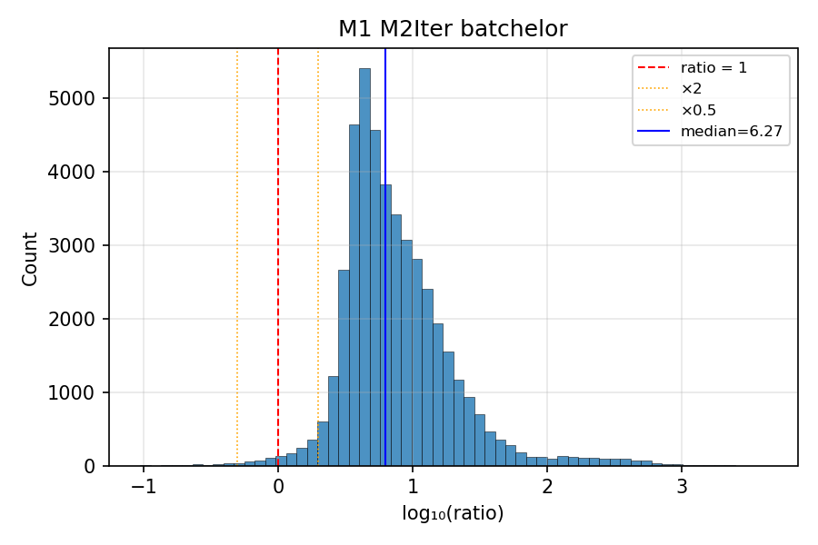
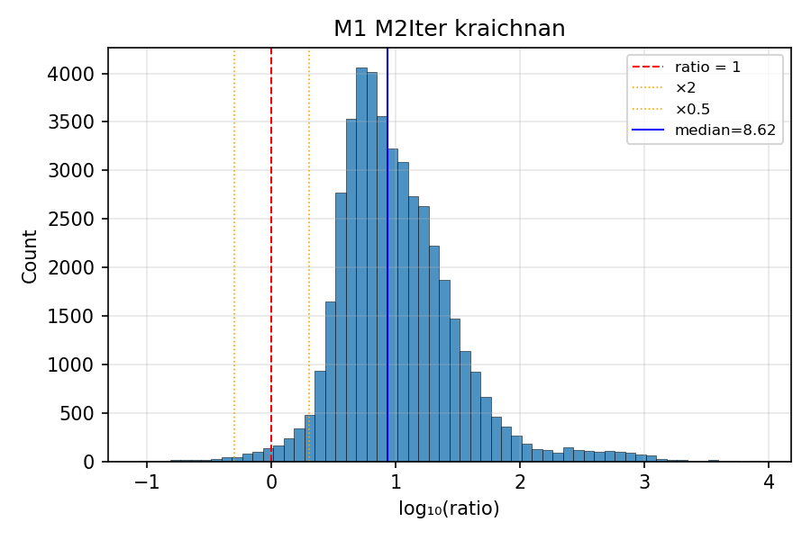
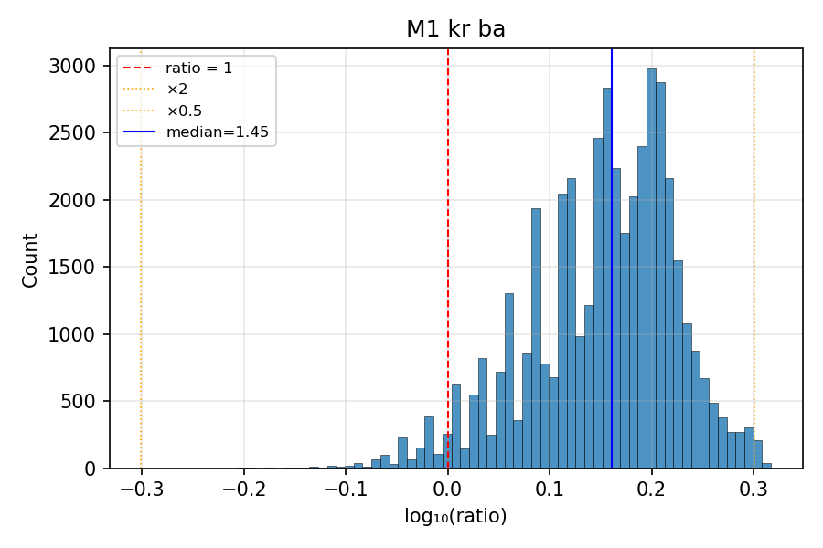
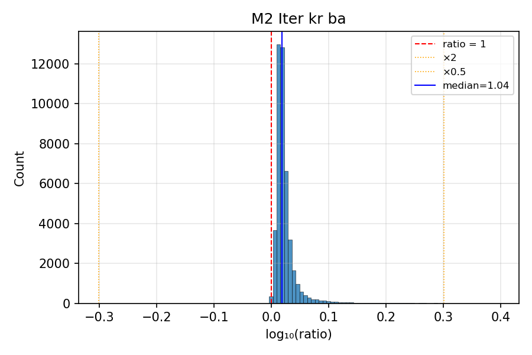

# Chi Method Comparison

Comparison of chi (thermal variance dissipation rate) estimates from three
methods across 29 VMP .p files (89572 window-probe observations).

## Methods

| Method | Description | kB source | Chi estimation |
|:-------|:------------|:----------|:---------------|
| **M1** | Dillon & Caldwell 1980 | Fixed from shear-probe epsilon | Log-space LS fit: min Σ[log(model)-log(obs)]² with kB fixed |
| **M2-Iter** | Peterson & Fer 2014 | MLE grid search (iterative) | Noise-subtracted integration + unresolved variance from model |
| **M2-MLE** | Ruddick et al. 2000 | MLE grid search | Variance correction with fitted kB |

## Spectrum Models

| Model | Reference | Rolloff | Constant |
|:------|:----------|:--------|:---------|
| **Batchelor** | Dillon & Caldwell 1980 | Gaussian (erfc) | q = 3.7 |
| **Kraichnan** | Bogucki et al. 1997 | Exponential | q = 5.26 |

## Ratio Statistics

Ratios are computed per-window, per-probe where both values are finite and positive.
"Std (log10)" is the standard deviation of log₁₀(ratio), measuring spread on
a multiplicative scale.

| Ratio | N | Median | Mean | Std | Q5 | Q95 |
|:------|--:|-------:|-----:|----:|---:|----:|
| M1_M2Iter_batchelor | 44786 | 6.273 | 17.574 | 0.416 (log10) | 2.521 | 39.041 |
| M1_M2Iter_kraichnan | 44786 | 8.618 | 29.700 | 0.482 (log10) | 2.536 | 66.178 |
| M1_kr_ba | 44786 | 1.448 | 1.438 | 0.072 (log10) | 1.044 | 1.786 |
| M2_Iter_kr_ba | 44786 | 1.043 | 1.056 | 0.021 (log10) | 1.017 | 1.129 |

## Histograms

### M1 M2Iter batchelor

### M1 M2Iter kraichnan

### M1 kr ba

### M2 Iter kr ba

## Notes

- **M1 vs M2-Iter**: M1 uses epsilon from shear probes to fix the Batchelor
  wavenumber kB, then fits chi amplitude via log-space least squares. M2-Iter
  fits both kB and chi from the temperature gradient spectrum alone. When
  shear-derived epsilon is consistent with the thermal spectrum, these should
  agree; large ratios indicate epsilon/chi inconsistency (variable dissipation
  ratio).

- **Kraichnan vs Batchelor**: The Kraichnan model has a slower (exponential)
  rolloff than Batchelor (Gaussian erfc), which better matches DNS results.
  Both are normalised to integrate to χ/(6κ_T), so chi values should be
  similar; differences arise from the spectral shape affecting the fit and
  variance correction.

- FOM (figure of merit) values near 1.0 indicate the fitted model matches the
  observed spectrum well. Values far from 1 suggest shape mismatch (wrong kB)
  or noise contamination.
