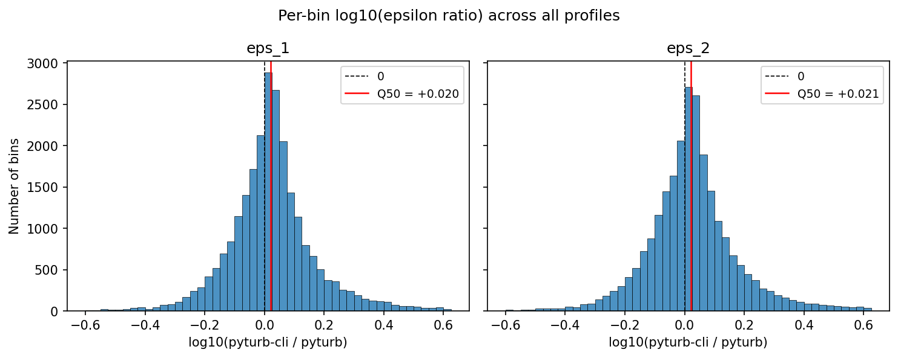

# pyturb vs pyturb-cli: Quantitative Comparison

Comparison of epsilon (TKE dissipation rate) estimates from
[Jesse's pyturb](https://github.com/oceancascades/pyturb) and
`pyturb-cli` (this repository) on ARCTERX VMP-250 data
(SN 479, R/V Thompson, January 2025).

Both tools were run with matching parameters:
- `--fft-len 1.0` (512 samples at 512 Hz)
- `--diss-len 4.0` (2048 samples at 512 Hz)
- Goodman cleaning: **off** (`pyturb-cli` default matches pyturb)
- Overlap: n_fft // 2 = 256 samples

Epsilon values are compared by interpolating `log10(epsilon)` from
pyturb-cli onto pyturb's pressure grid.  Statistics are computed
over all pressure-matched bins across all profiles.

*Generated 2026-03-15 from 29 VMP .p files.*

## Summary

| Metric | Value |
|--------|-------|
| .p files processed | 28 |
| Total profiles | 459 |
| Profiles compared | 448 |
| pyturb-cli only | 0 |
| pyturb only | 11 |
| Pressure-matched bins (eps_1) | 24932 |
| Pressure-matched bins (eps_2) | 24932 |

## log10(pyturb-cli / pyturb) Quantiles

Quantiles of `log10(eps_cli / eps_pyturb)` over all pressure-matched bins.  A value of 0 means perfect agreement; +0.04 means pyturb-cli is ~10% higher.

| Variable | N | Q0 (min) | Q5 | Q50 (median) | Q95 | Q100 (max) |
|----------|---|----------|----|--------------|-----|------------|
| `eps_1` | 24932 | -1.455 | -0.204 | +0.020 | +0.324 | +3.141 |
| `eps_2` | 24932 | -1.537 | -0.210 | +0.021 | +0.335 | +2.607 |

At the median, pyturb-cli epsilon is +5% relative to pyturb for eps_1 and +5% for eps_2. The worst-case bin differs by a factor of 1383.7x. The systematic offset is attributable to differences in the spectral estimation method (SCOR-160 vs custom) and Macoun & Lueck spatial response correction (applied in pyturb-cli, not in pyturb).

## Distribution of Per-Bin log10(epsilon ratio)

## Processing Differences

| Feature | pyturb | pyturb-cli |
|---------|--------|------------|
| Shear spectrum | Custom | SCOR-160 (Lueck 2024) |
| Noise removal | None | Goodman (opt-in via `--goodman`) |
| Spatial correction | None | Macoun & Lueck (2004) |
| Window conversion | `int(s*fs)`, even | Same (matching pyturb) |
| Overlap | n_fft // 2 | Same (matching pyturb) |
| Profile detection | profinder | scipy.signal.find_peaks |
| CLI framework | Typer | argparse |
